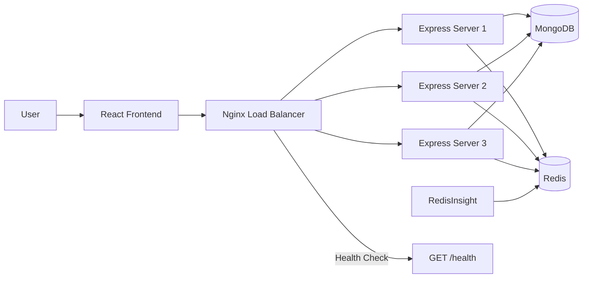
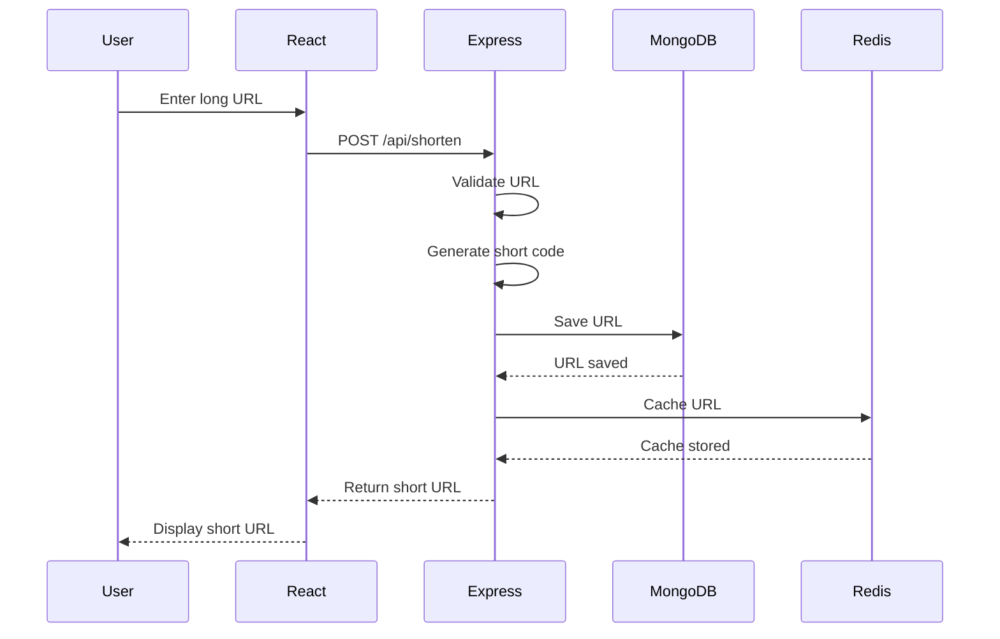
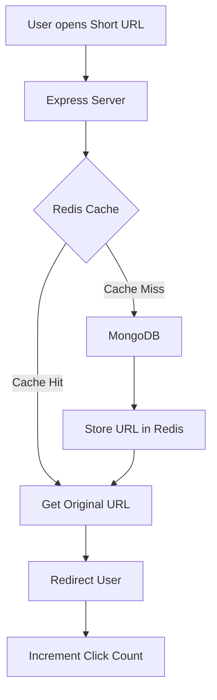
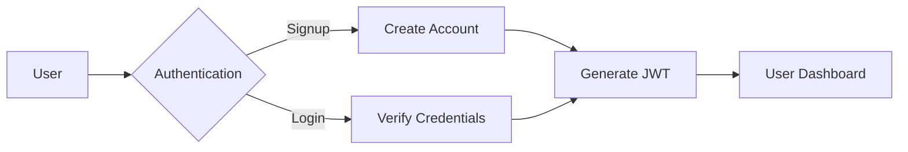
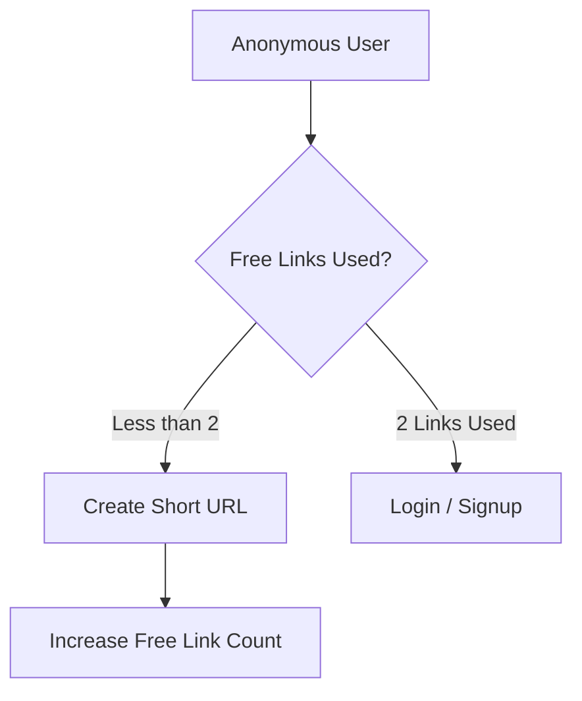
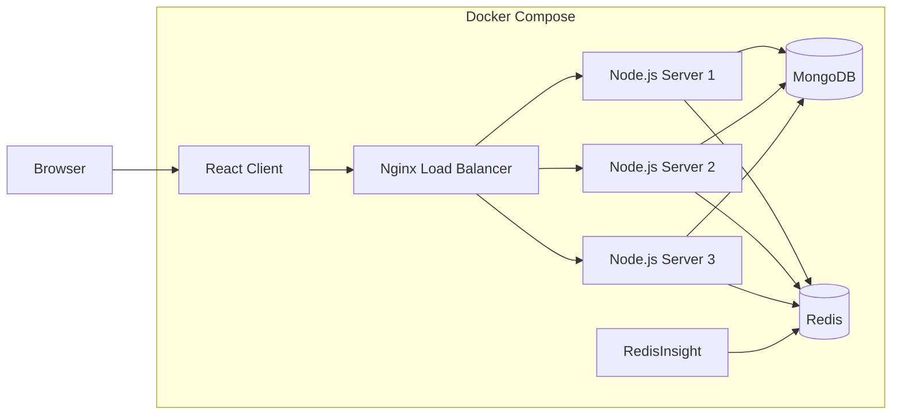

# ShortLink 🔗 — Scalable URL Shortener

A full-stack URL shortening application built with **React.js, Node.js, Express.js, MongoDB, and Redis**.

The project focuses on practical backend engineering concepts such as **Redis caching, URL redirection, authentication, click tracking, rate limiting, and containerized deployment**.


---

## Features

- 🔗 Create short URLs from long URLs
- ⚡ Redis caching for fast URL redirection
- 👤 User signup and login
- 🔐 JWT-based authentication
- 🔒 Password hashing using bcrypt
- 📊 Click tracking
- 📈 User dashboard
- 🗑️ Delete shortened URLs
- 📋 Copy shortened URLs
- 📤 Share shortened URLs
- 🚦 Rate limiting
- 🛡️ Helmet security middleware
- Anonymous users can create up to 2 free links
- ⚖️ Nginx reverse proxy and round-robin load balancing
- 🖥️ Three horizontally scaled Express backend instances
- ❤️ Health check endpoint for backend instance verification
- 🐳 Dockerized development environment
- 🔴 RedisInsight for Redis monitoring
- 💾 MongoDB for persistent storage

---

## Architecture



---

## URL Shortening Flow



---

## URL Redirection Flow



---

## Authentication Flow



---

## Anonymous User Flow



---

## Load Balancing

Nginx acts as the reverse proxy and load balancer in front of three Express backend instances:

```text
                    Nginx
                      |
          +-----------+-----------+
          |           |           |
          v           v           v
       Server1     Server2     Server3
```

The backend instances are configured with the same application environment and share MongoDB and Redis.

Nginx uses round-robin distribution by default. The setup was verified using repeated requests to:

```http
GET /health
```

Example response:

```json
{
  "status": "ok",
  "server": "server1"
}
```

Repeated requests return `server1`, `server2`, and `server3`, demonstrating that traffic is distributed across the backend instances.

## Redis Cache Strategy

```text
Short URL Request
       |
       v
     Redis
       |
   +---+---+
   |       |
  HIT    MISS
   |       |
   v       v
 URL     MongoDB
   |       |
   |       v
   |     Redis
   |       |
   +---+---+
       |
       v
    Redirect
```

Redis follows a **cache-aside strategy**:

1. Check Redis for the short code.
2. If found, use the cached URL.
3. If not found, query MongoDB.
4. Store the URL in Redis.
5. Redirect the user.

---

## Dashboard

Authenticated users can:

- View their shortened URLs
- View original URLs
- View click counts
- Open short URLs
- Copy short URLs
- Share URLs
- Delete URLs

---

## Click Tracking

Every successful short URL access updates the click count.

```text
User
 |
 | GET /abc1234
 v
Express
 |
 v
Redis
 |
 v
Original URL
 |
 v
Redirect
 |
 v
Click Count Update
 |
 v
MongoDB
```

---

## API Endpoints

### Create Short URL

```http
POST /api/shorten
```

Request:

```json
{
  "longUrl": "https://example.com"
}
```

Response:

```json
{
  "shortCode": "abc1234",
  "shortUrl": "http://localhost:5000/abc1234",
  "longUrl": "https://example.com"
}
```

### Redirect

```http
GET /:shortCode
```

Example:

```text
http://localhost:5000/abc1234
```

### Health Check

```http
GET /health
```

---

## Authentication API

### Signup

```http
POST /api/signup
```

Request:

```json
{
  "name": "User",
  "email": "user@example.com",
  "password": "password"
}
```

### Login

```http
POST /api/login
```

Request:

```json
{
  "email": "user@example.com",
  "password": "password"
}
```

---

## Project Structure

```text
url_shortner/
│
├── client/
│   ├── src/
│   │   ├── App.jsx
│   │   ├── App.css
│   │   └── main.jsx
│   ├── Dockerfile
│   ├── .dockerignore
│   └── package.json
│
├── server/
│   ├── models/
│   │   ├── Url.js
│   │   └── User.js
│   │
│   ├── routes/
│   │   ├── shorten.js
│   │   ├── redirect.js
│   │   └── auth.js
│   │
│   ├── middleware/
│   ├── tests/
│   ├── index.js
│   ├── Dockerfile
│   ├── .dockerignore
│   └── package.json
│
├── docker-compose.yml
├── README.md
└── .gitignore
```

---

## Technology Stack

### Frontend

- React.js
- Vite
- Axios
- CSS

### Backend

- Node.js
- Express.js
- REST API

### Database

- MongoDB

### Caching

- Redis

### Authentication

- JSON Web Token
- bcryptjs

### Security

- Helmet
- Express Rate Limit

### DevOps

- Docker
- Docker Compose
- RedisInsight

### Testing

- Jest
- Supertest
- MongoDB Memory Server

---

## Docker Architecture



---

## Environment Variables

### Server

Create a `.env` file inside the `server` directory:

```env
MONGO_URI=your_mongodb_connection_string
REDIS_URL=redis://redis:6379
JWT_SECRET=your_jwt_secret
PORT=5000
```

### Client

Create a `.env` file inside the `client` directory:

```env
VITE_API_URL=http://localhost:5000
```

Never commit real credentials or secrets to GitHub.

---

## Running with Docker

Clone the repository:

```bash
git clone https://github.com/radhey004/url_shortner.git
cd url_shortner
```

Build and start the application:

```bash
docker compose up -d --build
```

Check running containers:

```bash
docker compose ps
```

View server logs:

```bash
docker compose logs -f server
```

Stop the application:

```bash
docker compose down
```

Restart:

```bash
docker compose restart
```

Rebuild after code changes:

```bash
docker compose down
docker compose up -d --build
```

---

## RedisInsight

RedisInsight is included in the Docker Compose setup for inspecting Redis data.

Open:

```text
http://localhost:5540
```

Docker Redis connection:

```text
Host: redis
Port: 6379
```

Useful Redis commands:

```bash
docker compose exec redis redis-cli PING
```

```bash
docker compose exec redis redis-cli KEYS '*'
```

```bash
docker compose exec redis redis-cli GET shortUrl:abc1234
```

```bash
docker compose exec redis redis-cli TTL shortUrl:abc1234
```

---

## Local Development

### Backend

```bash
cd server
npm install
npm start
```

Backend:

```text
http://localhost:5000
```

### Frontend

```bash
cd client
npm install
npm run dev
```

Frontend:

```text
http://localhost:5173
```

---

## How the System Works

```text
                         +----------------+
                         |      User      |
                         +-------+--------+
                                 |
                                 v
                         +---------------+
                         | React Client  |
                         +-------+-------+
                                 |
                                 v
                         +---------------+
                         |     Nginx     |
                         | Load Balancer |
                         +-------+-------+
                                 |
                +----------------+----------------+
                |                |                |
                v                v                v
          +-----------+    +-----------+    +-----------+
          |  Server1  |    |  Server2  |    |  Server3  |
          |  Express  |    |  Express  |    |  Express  |
          +-----+-----+    +-----+-----+    +-----+-----+
                |                |                |
                +----------------+----------------+
                                 |
                         +-------+-------+
                         |               |
                         v               v
                  +-------------+  +-------------+
                  |    Redis    |  |   MongoDB   |
                  |    Cache    |  |  Database   |
                  +-------------+  +-------------+
```

Nginx distributes incoming requests across three independent Express server instances using round-robin load balancing.

The backend instances share the same MongoDB database and Redis cache, allowing the application to scale horizontally while maintaining shared application data and cached short URLs.

The `/health` endpoint can be used to verify which backend instance handled a request.

## Database Model

### URL

```text
URL
│
├── longUrl
├── shortCode
├── clicks
└── createdAt
```

### User

```text
User
│
├── name
├── email
├── password
└── createdAt
```

Passwords are stored as secure bcrypt hashes.

---

## Security

The application includes:

- JWT authentication
- bcrypt password hashing
- Helmet security headers
- Express rate limiting
- URL validation
- User-specific URL management
- Environment-based secret configuration

---

## Future Improvements

- Custom short URL aliases
- URL expiration
- QR code generation
- Advanced analytics
- Geographic analytics
- Custom domains
- Admin dashboard
- Swagger API documentation
- Monitoring and observability
- Production deployment improvements

---

## Project Goal

The goal of ShortLink is to demonstrate practical backend and system design concepts through a real-world URL shortening application.

Key concepts demonstrated:

- REST API design
- Authentication
- Database design
- Redis caching
- Cache-aside architecture
- URL redirection
- Click tracking
- Rate limiting
- Security middleware
- Docker containerization
- Nginx reverse proxy
- Horizontal scaling
- Round-robin load balancing
- Full-stack application development

---

## License

This project is for educational and portfolio purposes.
